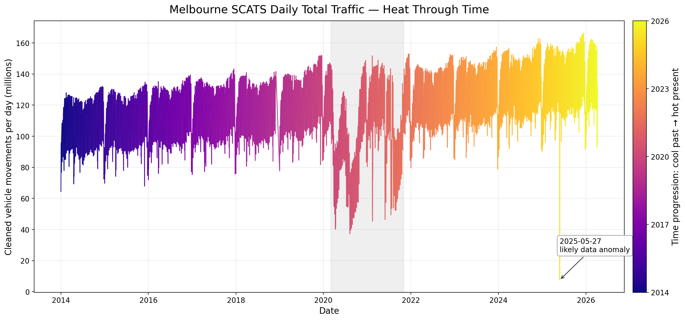

# melbourne-scats-intelligence
Open-source city-scale Melbourne SCATS traffic intelligence platform (2014–2026) using DuckDB, SQLite, GIS, and high-performance chunked analytics pipelines to transform billions of traffic observations into reproducible congestion, flow, mapping, and infrastructure intelligence.

## Daily Melbourne Traffic Volume

  

## Official SCATS Dataset Source

The underlying SCATS traffic signal volume data used throughout this project originates from the Victorian Government Open Data Portal operated by the Department of Transport and Planning.

🔗 Official Dataset:
https://opendata.transport.vic.gov.au/dataset/traffic-signal-volume-data

This project transforms raw SCATS and TIRTL transport sensor data into reproducible traffic intelligence, including:

Network-wide congestion analysis
Busiest intersections and corridors
Time-of-day traffic behavior profiling
Long-term traffic growth trends
Peak-share and directional flow analytics
Geographic traffic intelligence mapping
Outdoor advertising exposure analytics
High-resolution charting and media-ready visualizations
Large-scale reproducible transport analytics pipelines

The system was designed and built independently using commodity hardware, open-source tooling, and AI-assisted development techniques, processing more than 12 years of Melbourne traffic signal data across thousands of SCATS sites and hundreds of billions of vehicle movement events.

Technologies used include:

Python
DuckDB
SQLite
GIS / GeoJSON
Kepler.gl
Apache
PowerShell
Linux
High-volume chunked analytics pipelines

This repository contains methodology, scripts, visualizations, architecture documentation, and reproducible analytics workflows for large-scale urban traffic intelligence research.

Suitable for:

Transport researchers
Journalists
Urban planners
Smart-city researchers
GIS analysts
Infrastructure strategists
Outdoor advertising analytics
Data engineers
HPC and large-scale analytics enthusiasts

This project is intended to support open transport research,
reproducible analytics, journalism, and public-interest infrastructure
intelligence.

Created by Clarke Towson in Melbourne.
