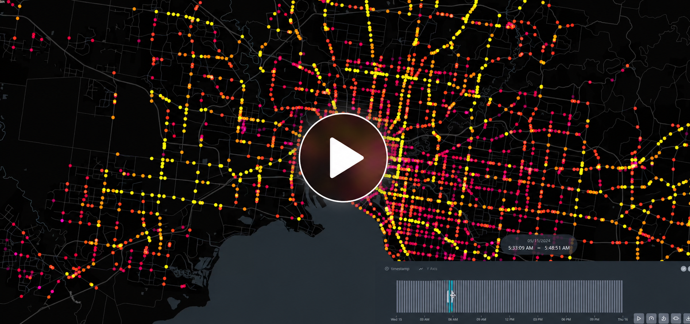
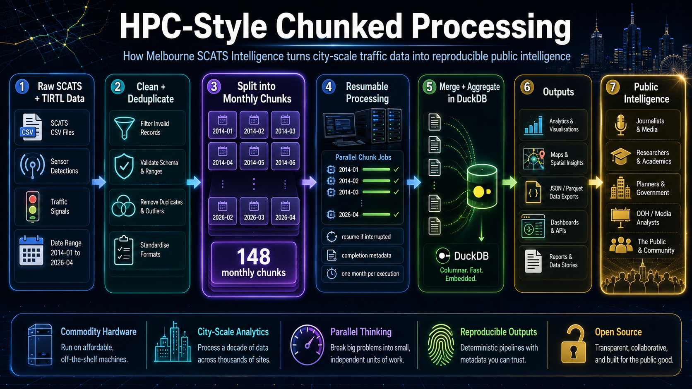

# Melbourne SCATS Intelligence

<p align="center">
  
</p>

<p align="center">
  <strong>Open-source city-scale Melbourne traffic intelligence from SCATS and TIRTL data.</strong>
</p>

<p align="center">
  2014–2026 • DuckDB • Python • SQLite • GIS • Kepler.gl • PowerShell • High-performance chunked analytics
</p>

---

## Melbourne SCATS Animation

<p align="center">
  <a href="docs/videos/SCATS_animation_with_music.mp4">
    
  </a>
</p>

<p align="center">
  <em>Short Kepler.gl animation showing Melbourne SCATS activity across the city network. Click the preview to open the video.</em>
</p>


## Project Summary

**Melbourne SCATS Intelligence** is an open-source traffic analytics project that transforms long-term Melbourne traffic signal volume data into reproducible city-scale movement intelligence.

The project uses high-performance local analytics pipelines to process more than 12 years of Melbourne traffic signal data across thousands of SCATS sites, producing network-wide congestion, flow, mapping, time-of-day, infrastructure, outdoor advertising, and public-interest transport intelligence.

This repository contains the methodology, scripts, selected outputs, documentation, and reproducible workflows needed to understand how the system was built and how similar approaches could be adapted to other cities.

---

## Official SCATS Dataset Source

The underlying SCATS traffic signal volume data used throughout this project originates from the Victorian Government Open Data Portal operated by the Department of Transport and Planning.

**Official dataset:**

https://opendata.transport.vic.gov.au/dataset/traffic-signal-volume-data

This repository does **not** include the full raw SCATS dataset or large local DuckDB databases. Those files are too large for normal GitHub storage and should be downloaded or regenerated separately.

---

## What This Project Produces

This project transforms raw SCATS and TIRTL transport sensor data into reproducible traffic intelligence, including:

- Network-wide traffic volume analysis
- Busiest intersections and corridors
- Long-term traffic growth trends
- Time-of-day traffic behaviour profiling
- Daily, monthly, yearly and seasonal traffic patterns
- Peak-share and directional flow analytics
- Weekday versus weekend traffic behaviour
- Geographic traffic intelligence mapping
- Outdoor advertising exposure analytics
- Kepler.gl-ready animation exports
- High-resolution charting and media-ready visualisations
- Large-scale reproducible transport analytics pipelines

---

## Core Engineering Idea - HPC-Style Chunked Processing

<p align="center">
  
</p>

---

The central idea is simple:

```text
Raw traffic signal volume data
        ↓
Cleaned and deduplicated observations
        ↓
15-minute traffic movement model
        ↓
Monthly chunked processing
        ↓
DuckDB-powered aggregation
        ↓
CSV / JSON / chart / map outputs
        ↓
Public traffic intelligence
```

The project is designed around **chunked processing**, because city-scale historical traffic datasets are too large to process casually or naively. Many scripts process one month at a time, write resumable outputs, and produce metadata that confirms whether the calculation completed successfully.

---

## Technologies Used

- Python
- DuckDB
- SQLite
- PowerShell
- GIS / GeoJSON
- Kepler.gl
- Apache / Linux hosting
- CSV and JSON reproducibility outputs
- High-volume chunked analytics pipelines
- Commodity workstation hardware

The system was designed and built independently using commodity hardware, open-source tooling, and AI-assisted development techniques.

---

## Repository Structure

```text
melbourne-scats-intelligence/
│
├── README.md
├── QUICKSTART.md
├── METHODOLOGY.md
├── REPRODUCIBILITY.md
├── HARDWARE_NOTES.md
├── CITY_ADAPTATION_GUIDE.md
│
├── scripts/
│   ├── aggregate/
│   ├── clean/
│   ├── dedupe/
│   ├── charts/
│   ├── maps/
│   ├── publishing/
│   ├── wrappers/
│   └── archive_review/
│
├── reports/
│   ├── headline_outputs/
│   ├── audit/
│   ├── priority_answers/
│   └── clean_outputs/
│
├── docs/
│   ├── data-schema.md
│   ├── known-issues.md
│   ├── project-metadata/
│   ├── logos/
│   └── screenshots/
│
├── examples/
│   └── sample-config.json
│
├── extras/
│   ├── skipped_text_data_logs/
│   └── reviewed_includes/
│
└── sql/
    └── duckdb_init.sql
```

---

## Key Documentation

Start here:

- [`QUICKSTART.md`](QUICKSTART.md) — how to approach the project
- [`METHODOLOGY.md`](METHODOLOGY.md) — processing model and analytical method
- [`REPRODUCIBILITY.md`](REPRODUCIBILITY.md) — what is included, what is excluded, and why
- [`HARDWARE_NOTES.md`](HARDWARE_NOTES.md) — practical notes on running large local analytics
- [`CITY_ADAPTATION_GUIDE.md`](CITY_ADAPTATION_GUIDE.md) — how the approach could be adapted to other cities
- [`docs/data-schema.md`](docs/data-schema.md) — portable schema concept
- [`docs/known-issues.md`](docs/known-issues.md) — local-path and large-dataset caveats
- [`docs/schemas/README.md`](docs/schemas/README.md) — DuckDB schema-only exports for reproducibility

---

## For Other Engineers

This repository is intended to be useful as both:

1. A reproducible Melbourne case study; and
2. A reference architecture for other cities with traffic detector, signal, loop, speed, flow, or sensor data.

The Melbourne-specific parts are mainly the source data format, site metadata, local road naming, and public-facing interpretation.

The reusable parts are the architecture:

- Normalise observations into 15-minute intervals
- Clean invalid or missing values
- Deduplicate repeated observations
- Process in monthly chunks
- Store and query in DuckDB
- Generate reproducible CSV and JSON outputs
- Produce charts, maps, dashboards and public intelligence products

A portable target schema for other cities is:

```text
site_id
site_name
latitude
longitude
count_date
detector_id
interval_index
time_bin
volume_15m
source_file
```

Once another city’s data can be transformed into that shape, many of the downstream methods in this project become reusable.

---

## Intended Audiences

This project is intended to support:

- Transport researchers
- Journalists
- Urban planners
- Smart-city researchers
- GIS analysts
- Infrastructure strategists
- Outdoor advertising analytics
- Data engineers
- Civic technology researchers
- HPC and large-scale analytics enthusiasts
- Public-interest infrastructure analysis

---

## What Is Not Included

This repository intentionally excludes very large or unsuitable files, including:

- Full raw SCATS data archives
- DuckDB database files
- SQLite database files
- Very large Kepler.gl CSV exports over GitHub-safe limits
- Videos
- Music
- Temporary binary files
- Python cache files

The full DuckDB database files are excluded, but schema-only exports are included under `docs/schemas/`.

Selected derived outputs, metadata files, charts, logs and reviewed supporting files are included where they are useful for reproducibility and small enough for GitHub.

---

## Reproducibility Philosophy

This project is built around the idea that public infrastructure data should be transformed into understandable, inspectable, reproducible public intelligence.

The goal is not only to publish traffic charts, but to show how the results were produced:

```text
data source
  → cleaning method
  → database structure
  → processing script
  → output file
  → chart or map
  → public interpretation
```

That chain is what makes the project useful for journalism, research, transport analysis and civic accountability.

---

## Public-Interest Use

This project is intended to support open transport research, reproducible analytics, journalism, and public-interest infrastructure intelligence.

It demonstrates how open government traffic data can be turned into:

- Better public understanding of road network behaviour
- Independent verification of traffic trends
- Media-ready infrastructure analysis
- Outdoor advertising and exposure intelligence
- Historical congestion and recovery analysis
- Reusable open-source transport analytics methods

---

## Created By

Created by **Clarke Towson** in Melbourne, Australia.

This project was built independently as part of a broader effort to understand Melbourne’s transport network using open data, commodity computing, high-performance local analytics, and reproducible public-interest research.
